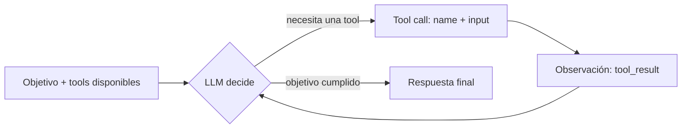
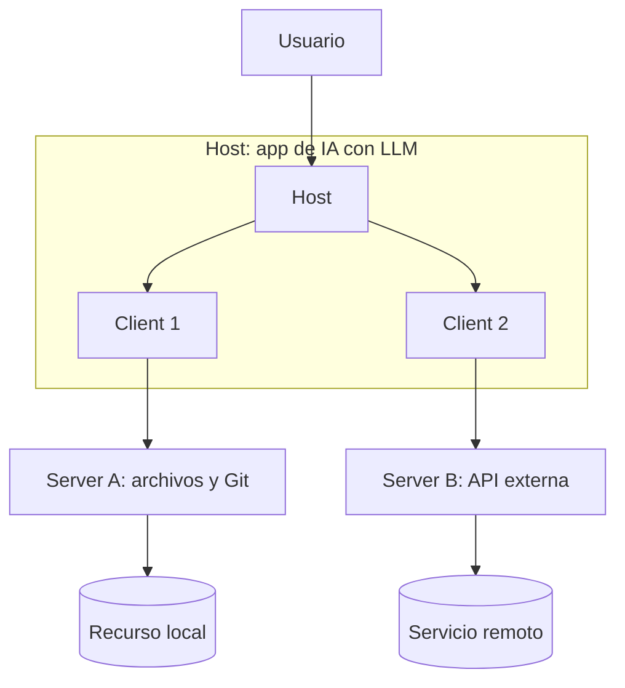

#code #ai #javascript #typescript

# Homework — Clase 1 (M5 BACK)

_Nota: las definiciones y los datos históricos provienen de las fuentes listadas al final. Las columnas "Cómo verifico éxito" y "Ejemplo" de la tabla 1.1, los ejemplos de la sección 1.3 y las analogías son construcciones propias (ilustrativas), no afirmaciones textuales de las fuentes._

## 1. Investigación profunda: Agentes, Tool Use y MCP

### 1.1 Definiciones comparativas

| Tipo | Qué produce | Cambia el estado de cosas en el mundo (sí / no) | Cómo verifico éxito | Ejemplo: pedido + evidencia esperada |
| - | - | - | - | - |
| **Chatbot** | Texto generado con el conocimiento almacenado en los parámetros del modelo (memoria paramétrica) y el historial de la conversación | No | Contrasto la respuesta con una fuente externa; el chatbot por sí solo no aporta procedencia | Pedido: "¿Qué es un pull request?" Evidencia: explicación que coincide con la documentación oficial de GitHub |
| **Asistente (RAG)** | Texto generado a partir de pasajes recuperados de una base externa (memoria no paramétrica) más el modelo | No (solo lee) | Cada afirmación se puede rastrear hasta un pasaje recuperado | Pedido: "¿Qué dice la guía del repo sobre nombres de ramas?" Evidencia: respuesta + fragmento o enlace al documento |
| **Agente** | Una secuencia de llamadas a tools y un resultado final, no solo texto | Sí (cuando sus tools escriben o actúan sobre el entorno) | Compruebo el estado del mundo después de actuar: el `tool_result` y el cambio visible en el sistema | Pedido: "Crea un issue para el bug X en el repo Y". Evidencia: número y URL del issue devueltos por la tool y visibles en GitHub |

- _RAG_ (Lewis et al., 2020) combina un modelo preentrenado (memoria paramétrica) con un índice externo consultado por un recuperador (memoria no paramétrica). Los autores señalan que dar procedencia a las respuestas y actualizar el conocimiento del modelo eran problemas abiertos que este enfoque busca atacar.
- Un **agente**, según Anthropic (2024b), es típicamente un LLM que usa tools guiado por la retroalimentación del entorno dentro de un loop; a diferencia de un _workflow_, que sigue caminos de código predefinidos.

### 1.2 Agent loop

- **Decide:** el LLM recibe el objetivo y la lista de tools disponibles, y decide cuál es la siguiente acción (llamar una tool o responder).
- **Llama la tool:** el modelo emite un bloque `tool_use` con `name` e `input`; el código de la aplicación (no el modelo) ejecuta la tool real con ese input.
- **Observa:** el resultado vuelve al historial como `tool_result`, y es la "verdad de terreno" que el agente obtiene del entorno en cada paso.
- **Elige el siguiente paso:** con esa observación el LLM decide si llama otra tool (por ejemplo, corrigiendo un parámetro), pide ayuda humana o termina con la respuesta final.



Fuentes: Anthropic (2024b); Claude API Docs, _How to implement tool use_.

### 1.3 Tool use / function calling

Un LLM no ve el código de una tool: solo ve su **contrato**. En la documentación de Claude, una tool se define con `name`, `description` y un esquema JSON de parámetros (`input_schema`; en el formato de OpenAI ese campo se llama `parameters`). Ese contrato mínimo le permite al modelo:

- **Elegir correctamente qué tool usar:** `name` y `description` le dicen qué hace la tool, cuándo usarla y qué devuelve. La documentación de Claude indica que una buena descripción cubre justo esos puntos, y que una descripción demasiado breve deja al modelo con muchas preguntas abiertas.
- **Completar parámetros sin ambigüedad:** el esquema fija nombres, tipos y cuáles son obligatorios; el modelo genera un bloque `tool_use` con `id`, `name` e `input` que debe ajustarse a ese esquema.
- **Producir outputs verificables:** la aplicación ejecuta la tool con ese `input` y devuelve un `tool_result` enlazado al `tool_use` original, de modo que cada paso deja un resultado observable que se puede comprobar.

**Ejemplo de descripción mala** (ejemplo propio):

```json
{ "name": "run", "description": "Hace cosas en GitHub.", "input_schema": { "properties": { "q": { "type": "string" } } } }
```

_Error que induce:_ el modelo no sabe si `run` lee o escribe, ni qué debe ir en `q`; puede elegirla para tareas no relacionadas o inventar el valor del parámetro.

**Ejemplo de descripción buena** (ejemplo propio):

```json
{ "name": "github_list_open_issues", "description": "Lista los issues abiertos de un repositorio. Solo consulta; no crea ni modifica nada. Devuelve número, título y URL de cada issue.", "input_schema": { "type": "object", "properties": { "owner": { "type": "string" }, "repo": { "type": "string" }, "limit": { "type": "integer", "minimum": 1, "maximum": 100 } }, "required": ["owner", "repo"] } }
```

_Error que evita:_ elegir una tool equivocada o con intención de escritura, pasar parámetros mal formados o incompletos, y no poder verificar la salida porque se sabe de antemano qué campos debe devolver.

Fuentes: Claude API Docs, _How to implement tool use_; Parallel Docs (diferencia `input_schema` / `parameters`).

### 1.4 MCP: qué es, qué problema y por qué es un estándar

MCP (Model Context Protocol) es un estándar abierto (open-source) creado en Anthropic y publicado el 25 de noviembre de 2024 para conectar aplicaciones y agentes de IA con **tools**, **datos** y **workflows**. Para un dev backend: en vez de escribir una integración a medida cada vez que una app de IA necesita hablar con GitHub, una base de datos o un sistema interno, expones esa capacidad una sola vez como un _MCP server_ y cualquier _MCP client_ que hable el protocolo puede descubrirla y usarla (una idea parecida a cómo muchos clientes consumen un mismo API bien definido; la analogía es propia). El valor está en la **interoperabilidad**: un protocolo único reemplaza integraciones fragmentadas y ad hoc para cada fuente de datos (Anthropic, 2024a). El objetivo final es pasar de modelos que solo generan "texto" a agentes que ejecutan **acciones con evidencia**, porque cada llamada a una tool devuelve un resultado observable. Desde diciembre de 2025 el proyecto está gobernado dentro de la Agentic AI Foundation (AAIF) de la Linux Foundation, y en ese momento el blog oficial de MCP reportaba más de 97 millones de descargas mensuales de SDK y unos 10.000 servers activos (Blog de MCP, 2025).

### 1.5 Arquitectura Host/Client/Server

- **Host:** la aplicación de IA (por ejemplo Claude Code, Claude Desktop o Visual Studio Code) que coordina uno o varios clients. Crea y gestiona los clients, controla permisos y ciclo de vida de las conexiones, y hace cumplir las políticas de seguridad y consentimiento.
- **Client:** componente creado por el host que mantiene la conexión con **un** server y obtiene contexto de él para que el host lo use (relación 1:1 client–server).
- **Server:** programa que proporciona contexto (tools, recursos) a los clients; puede correr en la máquina local o de forma remota.
- **Integración:** el host crea un client por cada server; el client negocia capacidades con su server y le envía las solicitudes; el server responde; y las interacciones entre distintos servers pasan siempre por el host.



Para construir un **Server** se usan los SDKs oficiales del proyecto (en el lanzamiento, Python y TypeScript): se declaran las capacidades que ofrece (por ejemplo _tools_) y se implementa el código que atiende cada solicitud. El **Host** orquesta: crea los clients, conserva el historial completo de la conversación, decide qué server se usa y aplica los límites de seguridad y consentimiento del usuario.

Fuentes: MCP Docs, _Architecture overview_ (versión 2026-07-28); MCP Specification, _Architecture_; Anthropic (2024a).

### 1.6 Origen y gobernanza (investigación con citas)

**¿Quién creó/lanzó MCP y cuándo?**

- MCP fue creado en Anthropic por David Soria Parra y Justin Spahr-Summers, y Anthropic lo publicó como open-source el **25 de noviembre de 2024** (año 2024, mes noviembre, día 25). Lanzó junto con la especificación y los SDKs, soporte para servers locales en Claude Desktop y un repositorio de servers de ejemplo (Google Drive, Slack, GitHub, Git, Postgres y Puppeteer) (Anthropic, 2024a) — _fuente primaria_.
- Un análisis posterior de The New Stack (2025b) describe cómo, tras ese lanzamiento en noviembre de 2024, el protocolo pasó de ser sobre todo una herramienta para mejorar el desarrollo asistido por IA a un estándar ampliamente aceptado en cuestión de un año — _fuente secundaria_.
- Nota: el artículo de Raygun (2024) ubica el lanzamiento el 26 de noviembre; la fecha de publicación del anuncio de Anthropic es el 25 de noviembre de 2024, que es la que se usa aquí.

**¿Qué cambió con la Linux Foundation / AAIF y por qué importa la neutralidad?**

- El **9 de diciembre de 2025** la Linux Foundation anunció la creación de la Agentic AI Foundation (AAIF), con tres proyectos fundadores: MCP (Anthropic), goose (Block) y AGENTS.md (OpenAI) (Linux Foundation, 2025) — _fuente primaria_. La AAIF es un _directed fund_ bajo la Linux Foundation, cofundado por Anthropic, Block y OpenAI, con apoyo de Google, Microsoft, AWS, Cloudflare y Bloomberg (Blog de MCP, 2025).
- Qué cambió en la práctica: el protocolo dejó de estar bajo el control de una sola empresa. Un consejo de gobierno de la AAIF decide inversiones estratégicas, presupuesto, miembros y aprobación de nuevos proyectos, mientras que cada proyecto, incluido MCP, conserva autonomía plena sobre su dirección técnica y su operación diaria; Anthropic dice que seguirá invirtiendo y manteniendo la infraestructura central (Blog de MCP, 2025).
- Por qué importa la neutralidad: la Linux Foundation y Anthropic la presentan como garantía de que el estándar siga abierto y dirigido por la comunidad; para competidores que ya lo adoptan (OpenAI, Google, Microsoft), depender de un protocolo controlado por un rival sería un riesgo (esta última parte es una inferencia propia).
- Perspectiva secundaria: TechCrunch (2025) lo enmarca como un esfuerzo por evitar la fragmentación propietaria y conectar modelos con herramientas sin adaptadores ad hoc, pero deja abierta la pregunta de si la AAIF será infraestructura real o solo una alianza de logos. The New Stack (2025a) señala que los miembros platino son Amazon, Anthropic, Block, Bloomberg, Cloudflare, Google, Microsoft y OpenAI — _fuente secundaria_.

## 2. Marketplace/Ecosistema: 3 servidores MCP relevantes

_Tabla para completar._

| Server (name) | Link al directorio + link al server | 2 tools que expone | Requisitos | Riesgos | Mitigación |
| - | - | - | - | - | - |
|   |   |   |   |   |   |
|   |   |   |   |   |   |
|   |   |   |   |   |   |

## 3. Diseño conceptual: Tool para un GitHub Agent

_Pendiente: el prompt no incluyó objetivos para esta sección._

## 4. Bitácora de uso de IA (crítica y verificable)

### Interacción 1 (prompt principal)

**Objetivo:** que la IA (Claude) construyera el README.md del homework con la investigación sobre agentes, tool use y MCP, usando solo información verificada y el formato Markdown pedido.

**Prompt exacto:** mensaje se encuentra en [Prompt Homework Módulo 5 Clase 1](20260929150313.md).

## Fuentes (bibliografía)

- Anthropic. (2024a, 25 de noviembre). _Introducing the Model Context Protocol_. https://www.anthropic.com/news/model-context-protocol
- Anthropic. (2024b, diciembre). _Building effective agents_. https://www.anthropic.com/engineering/building-effective-agents
- Claude API Docs. _How to implement tool use_. https://platform.claude.com/docs/en/agents-and-tools/tool-use/implement-tool-use
- Lewis, P., Perez, E., Piktus, A., Petroni, F., Karpukhin, V., Goyal, N., Küttler, H., Lewis, M., Yih, W., Rocktäschel, T., Riedel, S., & Kiela, D. (2020). _Retrieval-Augmented Generation for Knowledge-Intensive NLP Tasks_. Advances in Neural Information Processing Systems, 33. https://arxiv.org/abs/2005.11401
- Model Context Protocol. _Architecture overview_ (versión 2026-07-28). https://modelcontextprotocol.io/docs/2026-07-28/learn/architecture
- Model Context Protocol. _Specification: Architecture_. https://modelcontextprotocol.io/specification/2026-07-28/architecture
- Linux Foundation. (2025, 9 de diciembre). _Linux Foundation Announces the Formation of the Agentic AI Foundation (AAIF), Anchored by New Project Contributions Including Model Context Protocol (MCP), goose and AGENTS.md_. https://www.linuxfoundation.org/press/linux-foundation-announces-the-formation-of-the-agentic-ai-foundation
- Blog de MCP. (2025, 9 de diciembre). _MCP joins the Agentic AI Foundation_. https://blog.modelcontextprotocol.io/posts/2025-12-09-mcp-joins-agentic-ai-foundation/
- TechCrunch. (2025, 9 de diciembre). _OpenAI, Anthropic, and Block join new Linux Foundation effort to standardize the AI agent era_. https://techcrunch.com/2025/12/09/openai-anthropic-and-block-join-new-linux-foundation-effort-to-standardize-the-ai-agent-era/
- The New Stack. (2025a, diciembre). _Anthropic Donates the MCP Protocol to the Agentic AI Foundation_. https://thenewstack.io/anthropic-donates-the-mcp-protocol-to-the-agentic-ai-foundation/
- The New Stack. (2025b, diciembre). _Why the Model Context Protocol Won_. https://thenewstack.io/why-the-model-context-protocol-won/
- Raygun. (2024, diciembre). _Engineering AI systems with Model Context Protocol_. https://raygun.com/blog/announcing-mcp/
- Parallel Docs. _Anthropic Tool Calling_ (comparación de `input_schema` y `parameters`). https://docs.parallel.ai/integrations/anthropic-tool-calling
